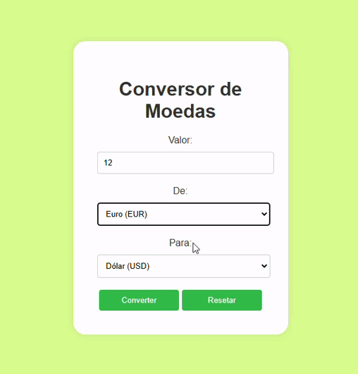

# ``Conversor de Moedas em Tempo Real``
 
## ÍNDICE
* [FUNCIONALIDADES](#funcionalidades)
* [TECNOLOGIAS UTILIZADAS](#tecnologias-utilizadas)
* [INTEGRAÇÃO COM API DE CÂMBIO](#integração-com-api-de-câmbio)
* [RESULTADO](resultado)
* [AUTORES](#autores)
 
Este projeto é uma versão atualizada do projeto 'Conversor de Moedas Simples' que permite ao usuário converter valores entre diferentes moedas em tempo real. A aplicação se integra com uma API de câmbio para consultar as taxas de conversão atualizadas, garantindo valores precisos de acordo com as variações do mercado.
 
## ``Funcionalidades``
 
- **``Entrada de Valor``**: Permite que o usuário insira um valor em uma moeda de origem para realizar a conversão.
- **``Seleção de Moedas``**: O usuário escolhe a moeda de origem e a moeda de destino a partir de uma lista (ex.: Dólar, Euro, Real).
- **``Conversão em Tempo Real``**: A aplicação consulta uma API de câmbio para obter cotações atuais e calcula a conversão.
- **``Botão Reset``**: O formulário inclui um botão "Limpar" para redefinir os campos para uma nova conversão.
- **``Exibição de Resultados``**: O valor convertido é mostrado na interface com a indicação da moeda de destino.
 
## ``Tecnologias Utilizadas``
 
- **``HTML5``**: Estruturação da página com formulários semânticos (`<form>`, `<input>`, `<select>`) para entrada e seleção de valores.
- **``CSS3``**: Estilização da página com foco em simplicidade e responsividade, garantindo acessibilidade em diferentes dispositivos.
- **``JavaScript Puro``**: Implementação da lógica de conversão e integração com API de câmbio.
 
## ``Integração com API de Câmbio``
 
A aplicação realiza consultas em uma API de câmbio, como ExchangeRate-API, Open Exchange Rates ou Fixer.io. Para o funcionamento correto, é necessário obter uma chave de API de uma dessas plataformas e configurá-la no projeto.
 
### ``Regras de Funcionamento``
 
- **``Consulta à API de Câmbio``**: Realizada com JavaScript puro, utilizando `fetch()` ou `XMLHttpRequest` para enviar requisições HTTP.
- **``Conversão Dinâmica``**: O valor recebido da API é usado diretamente na interface para calcular e exibir o resultado.
- **``Tratamento de Erros``**: Caso ocorra algum problema ao acessar a API ou realizar a conversão, a aplicação exibe uma mensagem de erro clara.
 
## ``Interface e Design``
 
A interface segue um layout minimalista para garantir usabilidade:
- Uso de cores contrastantes para facilitar a navegação.
- Botões bem visíveis para a conversão e reset dos campos.
 
## ``Requisitos para Execução``
 
- **``Navegador Web``**: A aplicação pode ser executada diretamente em navegadores modernos com suporte a JavaScript.
- **``Chave de API``**: Insira a chave de API no código JavaScript para ativar a funcionalidade de câmbio em tempo real.
 
## ``RESULTADO``:

 
## ``Autores``:
- [Leonardo Rocha](https://github.com/LeonardoRochaMarista/LeonardoRochaMarista)
- [Camila Casagrande Garcia](https://github.com/camilacasagrande)
- [Maria Eduarda](https://github.com/dudafontinele)
 